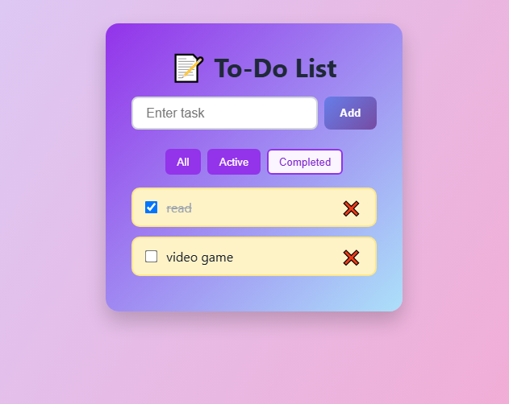
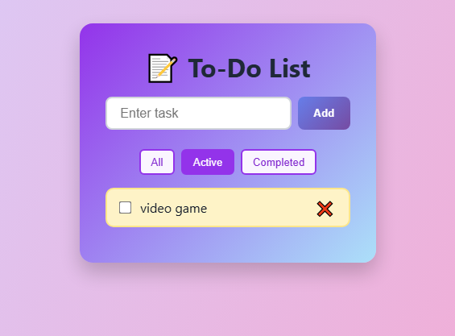
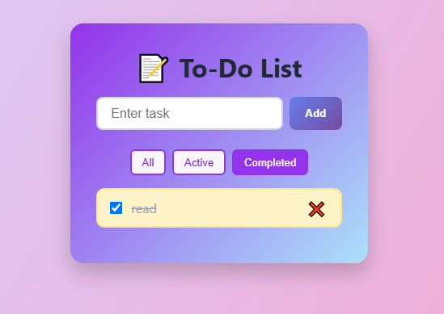

# 📝 React Vite To-Do List App

A vibrant, responsive and lightweight To-Do List web application built using **React + Vite**. Users can add, complete, delete, and filter tasks with seamless localStorage persistence.

## ✨ Features

- ✅ Add, complete, and delete tasks
- 🔍 Filter tasks by **All**, **Active**, or **Completed**
- 💾 Tasks are saved in `localStorage` (persistent)
- 🎨 Colorful & responsive design
- ⚡️ Built using **Vite** for fast dev experience

## 📸 Preview



## 🛠️ Tech Stack

- [React](https://reactjs.org/)
- [Vite](https://vitejs.dev/)
- HTML5 + CSS3 (Custom CSS)

## 🚀 Getting Started

### 1. Clone the repo

```bash
git clone https://github.com/yourusername/react-vite-todo.git
cd react-vite-todo
```

### 2. Install dependencies

```bash
npm install
```

### 3. Run the app

```bash
npm run dev
```

Open `http://localhost:5173` in your browser.

## 🧪 Testing Guide

- Add a task → It appears in the list.
- Mark it as completed → Strikethrough styling applies.
- Use filter buttons to view active/completed.
- Delete task → It disappears.
- Refresh → All tasks are still there (thanks to `localStorage`).

## 📂 Folder Structure

```
src/
├── components/
│   ├── TodoList.jsx
│   └── TodoItem.jsx
├── App.jsx
├── main.jsx
├── index.css
```

## 📦 Build for Production

```bash
npm run build
```

## 🌐 Deploy

You can easily deploy on platforms like **Vercel**, **Netlify**, or **GitHub Pages**.

## 📄 License

MIT © [Your Name](https://github.com/yourusername)
